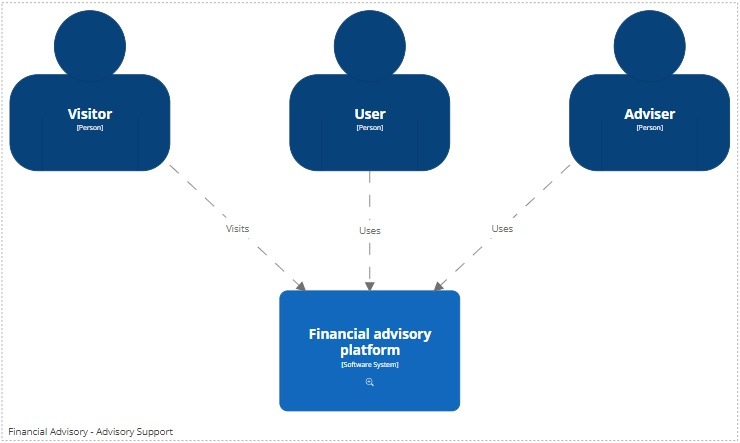
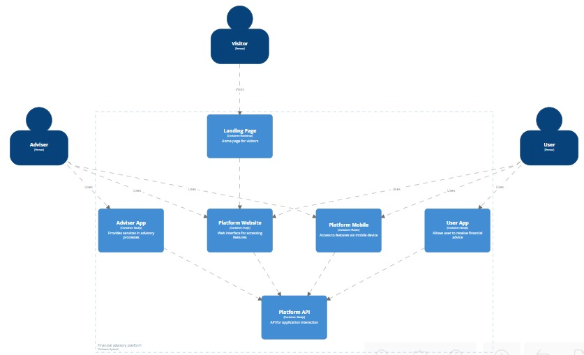

# Financial Advisory Support Application

The Financial Advisory Support Application is designed to serve as a medium for specialized advisers to provide advisory processes to their clients, with the goal of enhancing their financial status.

This application includes the following roles and components:

- **Roles**: Adviser, User, Visitor
- **Software Components**: Adviser App, User App, Mobile, Web App, Web API, Landing Page

The application is designed using the C4 model for visualizing software architecture. Below you can find the System Context and Container diagrams that provide a clear overview of the system's architecture.

## System Context Diagram

## Container Diagram

## Usage

Describe how to use your application here.

## Contributing

Contributions and suggestions are always welcome!
